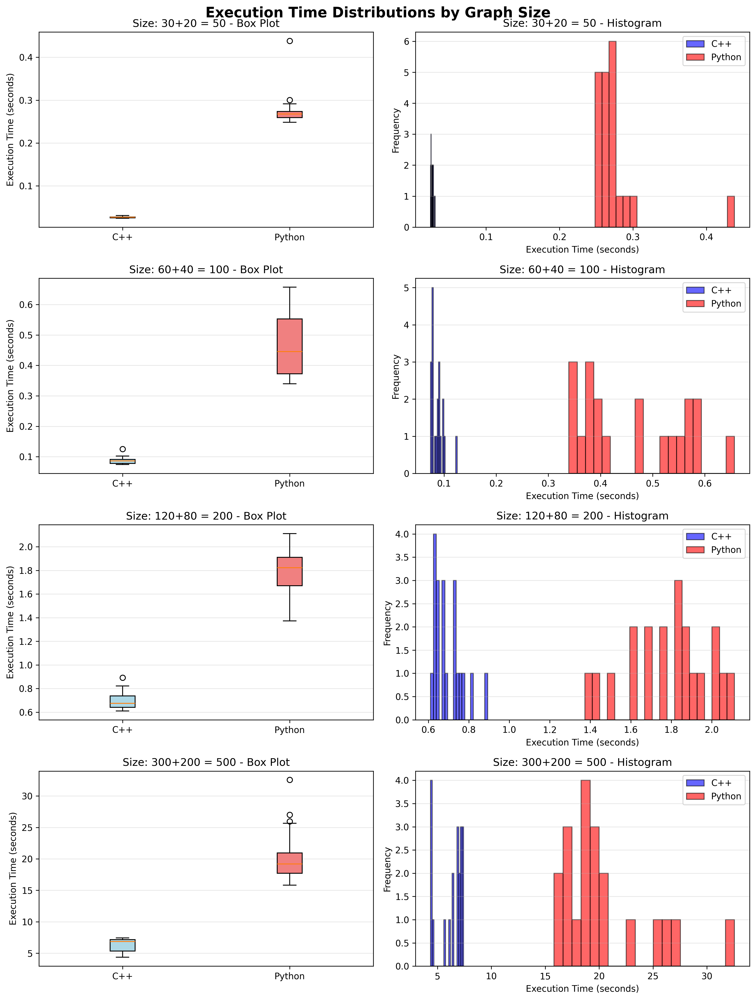
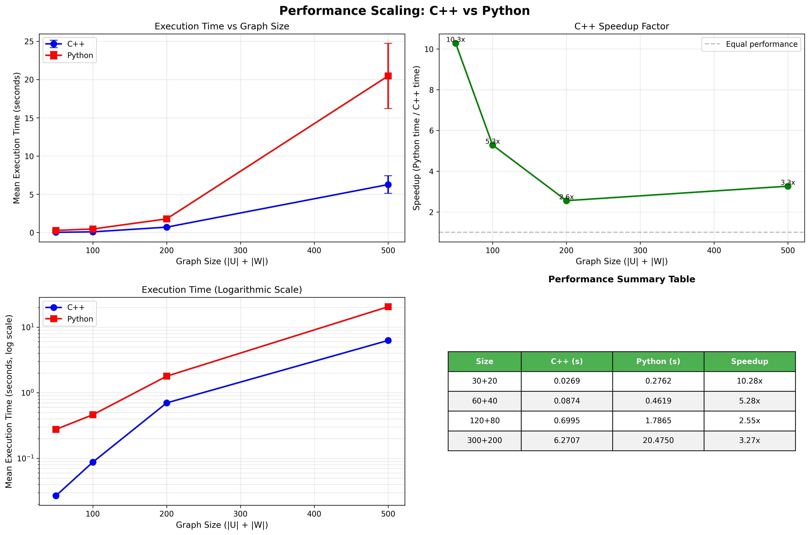

# algorithms-hw3-color-bipartite

## Завдання
> Варiант 6.

Розфарбування ребер бiпартитного (двочасткового) графа.<br>
Дано бiпартитний граф G = (U ∪ W, E). Потрiбно розфарбувати ребра в мiнiмальну<br>
кiлькiсть кольорiв так, щоб жоднi два сумiжнi ребра не мали однакового кольору.

Вхiднi данi: множини вершин U i W , список ребер.

Вихiднi данi: для кожного ребра — номер кольору; також вивести загальну кiлькiсть
використаних кольорiв.

## Приклади виконання:
### C++
#### Compilation
```
cmake -S . -B build
cmake --build build
```
#### Running
```
./build/color ./smallest_graph.txt ./smallest_graph_output_cpp.txt
```
```
./build/color ./small_graph.txt ./small_graph_output_cpp.txt
```

### Python
#### Running
```
python ./color_edges.py ./smallest_graph.txt -o ./smallest_graph_output_cpp.txt
```
```
python ./color_edges.py ./small_graph.txt -o ./small_graph_output_cpp.txt
```


## Алгоритм
За теоремою Кьоніга -- найменша кількість кольорів для розфарбування ребер двочасткового графа дорівнює найбільшому степіню вершин в графі.

Реалізований алгоритм дозаповнює dummy вершини та ребра, щоб всі вершини в графі мали однаковий степінь. <br>
Далі алгоритм для кожного кольору розв'язує задачу maximum matching. Фарбуємо вершини у поточний колір, видаляємо ребра з графу і повторюємо для наступного кольору. Таким чином на кожній ітерації степінь всіх вершин буде знижуватись на 1, а після розфарбування останнім кольором не залишиться не розфарбованих ребер

## Тестування
### color_edges.py
для порівняння був написаний модуль `color_edges.py`, який використовує `networkx.maximum_matching`. Зчитує файл вказаний в командному рядку

### generate_bipartite.py
модуль для генерації двочасткових графів через командний рядок у файл


### test.py
Запускає через командний рядок модулі C++ & Python для порівняння. При запуску з флагом `--plot` створює 2 картинки з графіками порівняння ефективності.
```
======================================================================
SUMMARY
======================================================================
Size            C++ (s)         Python (s)      Speedup
----------------------------------------------------------------------
50              0.026865        0.276155        10.28          x
100             0.087432        0.461909        5.28           x
200             0.699482        1.786451        2.55           x
500             6.270730        20.474965       3.27           x
```




### Висновок
алгоритм написаний на С++ виявився в 3 рази ефективнішим по часу виконання за python при великих графах.